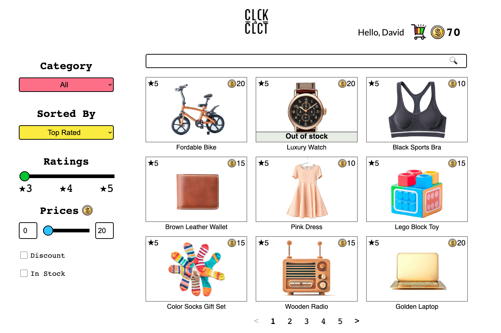

# Click and Collect

Click and Collect is an e-commerce web application built with React that demonstrates a simple virtual coin-based shopping experience. Users can browse products, add them to their cart, and complete the payment using virtual coins.

Live Demo: [Click and Collect](https://click-and-collect2.netlify.app/)

Design: [UI design document](https://docs.google.com/document/d/15QnEV2ltNrihVLnw0BZcTojHMTiw-c-2lqL-opQrZA8/edit?usp=sharing)

## Features

- Virtual coin system for purchasing items
- Interactive product browsing and cart management
- Fun and engaging payment experience with animations

## Tech Stack

- React
- React Router
- React Context API
- CSS

## Libraries

- axios
- react-countup
- react-confetti
- react-skeleton

## Backend

The backend is powered by a Django REST API, which provides product data to the frontend.

Repository: [Django Product API](https://github.com/taekim-dev/product-api)
